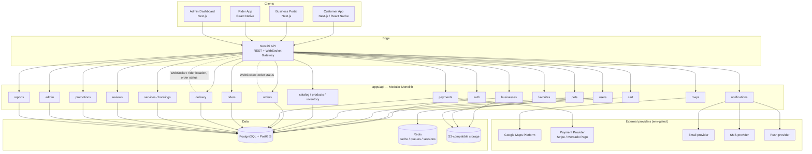

# BINGO+ — System Architecture

## 1. Style: Modular Monolith

For the MVP we build **one NestJS application** (`apps/api`) organized into strictly isolated
feature modules (per domain in `01-product-architecture.md`). Modules communicate through:

- Nest dependency injection (in-process service calls) — the default.
- A lightweight internal **EventEmitter bus** for cross-module side effects (e.g. `order.paid`
  triggers both `notifications` and `commissions` without `orders` importing either directly).

Rules that keep this monolith extractable later:

- A module **never imports another module's Prisma repository directly** — it depends on that
  module's public service interface (exported providers only).
- Cross-module reads go through the owning module's service, never through raw Prisma queries
  reaching into another module's tables.
- Each module owns its DTOs/validation; nothing reaches into another module's internals.

This means that when a domain needs to become its own service (most likely candidates: `delivery`
+ `riders`, and `payments`), the extraction is "cut the DI edge, add an HTTP/queue client" instead
of a rewrite.

## 2. High-level diagram

## 3. Request flow (typical write)

`Client → Controller (DTO validation) → Guard (JWT + RBAC) → Service (business rules) →
Prisma Repository → PostgreSQL`, with domain events emitted after the transaction commits for
any cross-module side effect (notifications, commission calculation, audit log).

## 4. Realtime

A single WebSocket gateway (Socket.IO, namespaced per concern: `/orders`, `/delivery`) authenticated
with the same JWT used for REST. Used for:

- Order status changes (customer + business).
- Rider location updates and order offers (rider + customer tracking screen).
- Admin live KPIs (future).

## 5. Caching & queues (Redis)

- **Cache**: geocoding results, business/product read-heavy lookups, rate-limit counters.
- **Session/cart**: server-side cart per user for fast read/write during shopping.
- **Queues** (BullMQ, added when Phase 3/4 need it): payment webhook processing, rider dispatch
  retries, notification delivery — so a slow external provider never blocks the request thread.

## 6. Storage

Business documents, business/product images, pet photos → S3-compatible object storage
(AWS S3 or a compatible provider such as Cloudflare R2/Backblaze for low-cost MVP hosting), never
stored in the database or on local disk in production.

## 7. Environments

`local` (Docker Compose: Postgres + Redis, API run with `npm run dev`) → `staging` → `production`.
Same Prisma schema and migrations across all three; only `.env` values differ.

## 8. Low-cost MVP deployment options

- **API**: a single container on Render/Railway/Fly.io (cheapest path), or a small VM/ECS task
  when volume grows.
- **Postgres**: managed Postgres with PostGIS extension available (Supabase, Neon w/ PostGIS,
  Railway, RDS) — avoid self-hosting for the MVP.
- **Redis**: managed free/low tier (Upstash, Railway).
- **Storage**: S3 or R2 (R2 has no egress fee, attractive at MVP scale).
- **Web apps**: Vercel (Next.js-native).
- **Mobile**: Expo EAS Build + OTA updates, no app-store-review cost during internal testing.

## 9. Scaling path (documented, not built for MVP)

- Extract `payments` and `delivery`/`riders` first — they have the clearest external boundaries
  and the highest write concurrency.
- Move dispatch and location updates to a dedicated realtime service backed by Redis pub/sub or a
  message broker (NATS/SQS) once rider volume requires horizontal scaling of the WebSocket layer.
- Introduce read replicas for `reports`/`admin` analytics before sharding anything.
