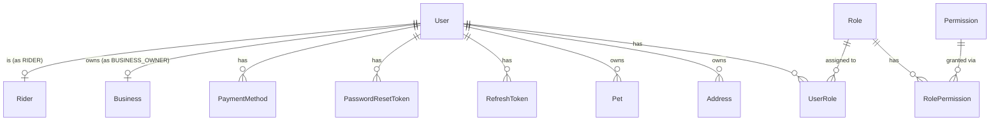
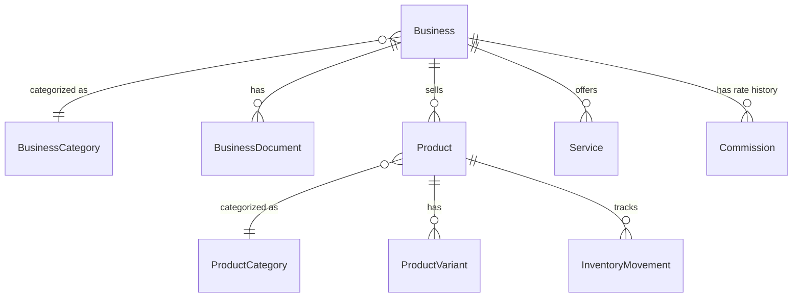
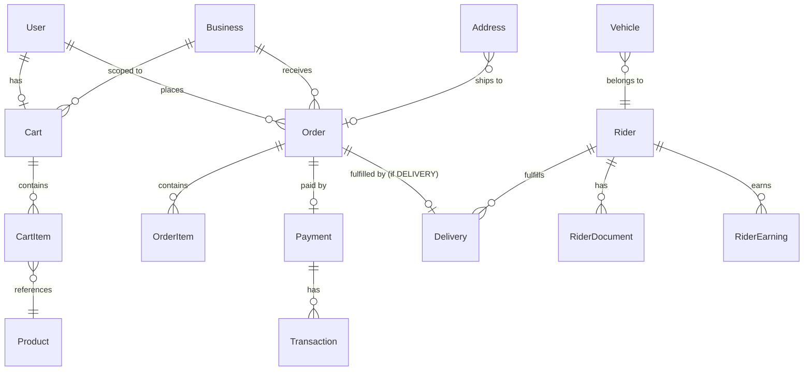
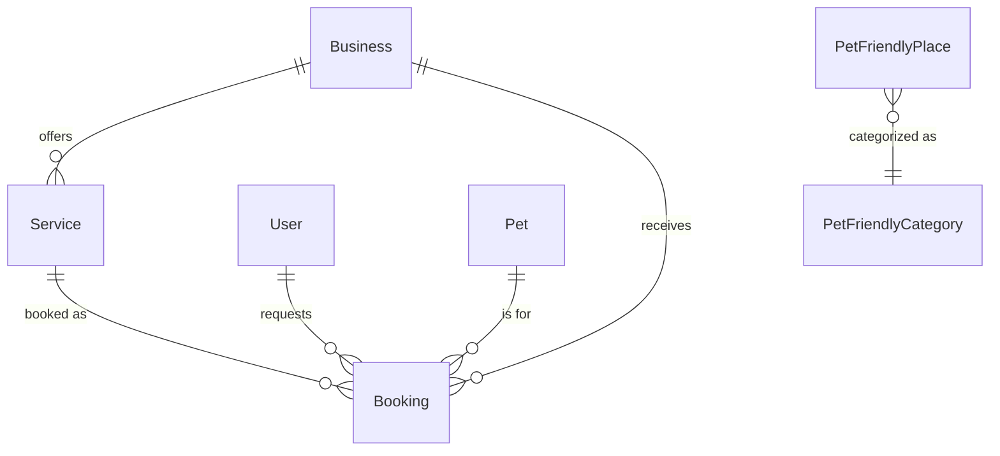
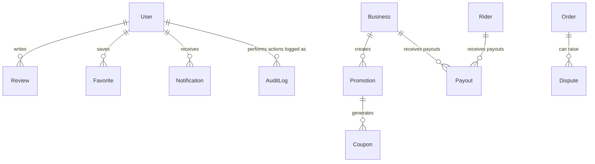

# BINGO+ — Database ERD

PostgreSQL 15+ with the **PostGIS** extension enabled (needed for `nearby business` /
`distance` queries in `businesses`, `riders.currentLocation`, and `pet_friendly_places`).
Full field-level definitions live in `04-database-schema.md`; this document shows relationships.

## Core identity & pets

## Businesses & catalog

## Commerce & fulfillment

## Services, bookings & directory

## Reputation, growth & marketplace economics

## Notes

- **Soft delete**: `User`, `Pet`, `Business`, `Product` carry `deletedAt` — never hard-deleted
  because they're referential targets of `Order`/`Booking`/`Review` history.
- **Money fields** use `Decimal(12,2)` (Prisma `Decimal`, Postgres `numeric`), never `float`.
- **Geolocation**: `Business.location`, `Rider.currentLocation`, `PetFriendlyPlace.location` are
  PostGIS `geography(Point, 4326)` columns (plus plain `latitude`/`longitude` for easy reads),
  indexed with `GIST` for radius queries.
